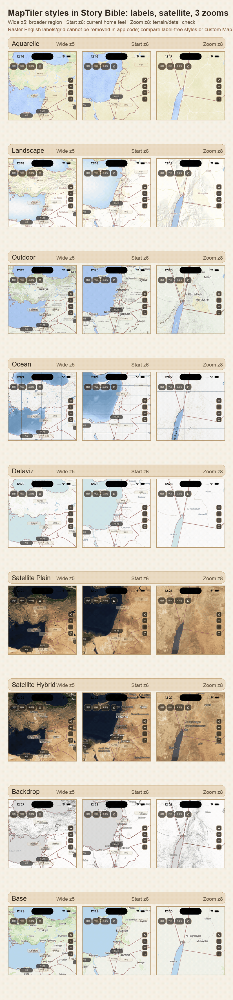
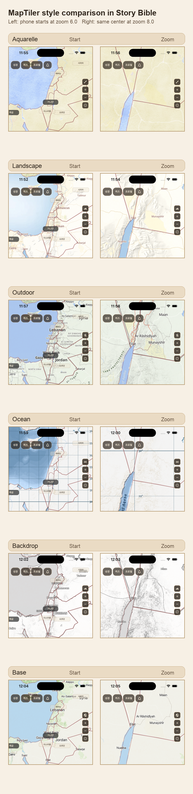

# 지도 타일 스타일 비교

성경 홈 지도 배경 후보를 같은 앱 오버레이(한국어 지역 라벨, 사건 핀, region
polygon) 위에서 비교한 PNG 자료다. 팀 공유나 디자인 선택 논의에는 최신 3단 줌
비교표를 우선 사용한다.

## 최신 비교표

기본 진입보다 넓은 영역, 기본 진입 줌, 확대 줌을 함께 비교한다. Satellite Plain
은 영문 지명 라벨이 없는 후보이고, Ocean 의 격자선은 raster tile 이미지에 포함된
요소라 앱 코드에서 따로 끌 수 없다.



## 이전 비교표

Topo 를 포함해 처음 비교했던 2단 줌 자료다. 후보 선정의 앞뒤 맥락을 보존하기 위해
함께 둔다.



## 앱에서 바꿔보는 방법

`.env` 에 아래 값 중 하나를 넣고 앱을 완전히 종료한 뒤 다시 실행한다. `.env` 는 hot
reload 만으로 다시 읽히지 않을 수 있다.

```bash
MAPTILER_API_KEY=너의_MapTiler_키
STORY_MAP_TILE_STYLE=mapTilerLandscape
```

사용 가능한 후보:

```bash
STORY_MAP_TILE_STYLE=mapTilerAquarelle
STORY_MAP_TILE_STYLE=mapTilerLandscape
STORY_MAP_TILE_STYLE=mapTilerOutdoor
STORY_MAP_TILE_STYLE=mapTilerOcean
STORY_MAP_TILE_STYLE=mapTilerDataviz
STORY_MAP_TILE_STYLE=mapTilerSatellitePlain
STORY_MAP_TILE_STYLE=mapTilerSatelliteHybrid
STORY_MAP_TILE_STYLE=mapTilerBackdrop
STORY_MAP_TILE_STYLE=mapTilerBase
```

빠른 임시 테스트는 `.env` 를 바꾸지 않고도 가능하다.

```bash
flutter run --dart-define=STORY_MAP_TILE_STYLE=mapTilerLandscape
```
