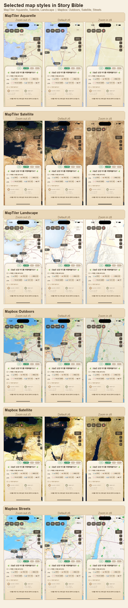
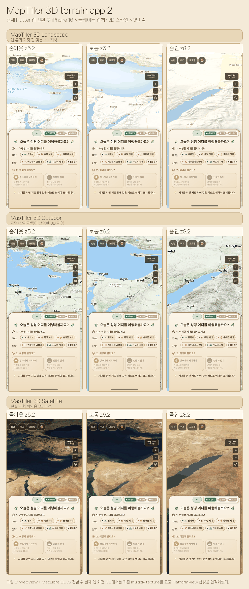

# 지도 타일 스타일 비교

성경 홈 지도 배경 후보를 같은 앱 오버레이(한국어 지역 라벨, 사건 핀, region
polygon) 위에서 비교한 PNG 자료다. 팀 공유나 디자인 선택 논의에는 최신 3단 줌
비교표를 우선 사용한다.

## 최신 비교표

현재 앱에 남긴 운영 후보는 OpenFreeMap 3D 무료 지형과 고지도 두 가지다.
아래 PNG 는 후보 선정 과정에서 만든 비교표이며, 기본 진입보다 넓은 영역, 기본
진입 줌, 확대 줌을 함께 비교한다.



## 3D 지형 전환 비교표

OpenFreeMap 3D Liberty 는 `flutter_map` raster tile 이 아니라 WebView +
MapLibre GL JS 렌더러로 전환한다. 키 없이 OpenFreeMap style 과 공개 Terrarium DEM
을 사용하고, pitch, bearing, terrain exaggeration 으로 산지/저지대 차이를 직접
보여 준다. 3D WebView 는 style configuration 이 바뀔 때만 재로드하고, 카메라
변화와 선택 상태 변화는 JS `easeTo()`/GeoJSON `setData()` 로 갱신한다.



## 이전 넓은 후보 비교표

초기 후보를 넓게 열어 봤던 3단 줌 자료다. Satellite Plain 은 영문 지명 라벨이
없는 후보이고, Ocean 의 격자선은 raster tile 이미지에 포함된 요소라 앱 코드에서
따로 끌 수 없다.


## 초기 비교표

Topo 를 포함해 처음 비교했던 2단 줌 자료다. 후보 선정의 앞뒤 맥락을 보존하기 위해
함께 둔다.


## 앱에서 바꿔보는 방법

`.env` 에 아래 값 중 하나를 넣고 앱을 완전히 종료한 뒤 다시 실행한다. `.env` 는 hot
reload 만으로 다시 읽히지 않을 수 있다.

```bash
STORY_MAP_TILE_STYLE=openFreeMap3dLiberty
```

사용 가능한 후보:

```bash
STORY_MAP_TILE_STYLE=openFreeMap3dLiberty
STORY_MAP_TILE_STYLE=watercolor
```

빠른 임시 테스트는 `.env` 를 바꾸지 않고도 가능하다.

```bash
flutter run --dart-define=STORY_MAP_TILE_STYLE=openFreeMap3dLiberty
```
